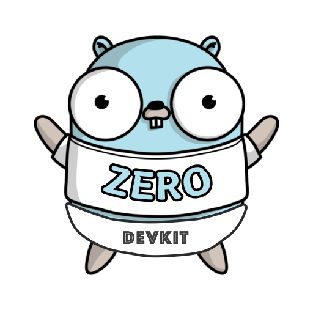

# Goctl Devkit

<!-- PROJECT LOGO -->
 

  
   
 
  IDEA development plugin for Go language microservice framework <a href="https://github.com/zeromicro/go-zero#advantages-of-go-zero">go-zero</a> 
  用于Go语言微服务框架<a href="https://github.com/zeromicro/go-zero#advantages-of-go-zero">go-zero</a>的IDEA开发插件 

## 目录

- [上手指南](#上手指南)
    - [开发前的配置要求](#开发前的配置要求)
- [插件展示](#插件展示)
- [作者](#作者)
- [鸣谢](#鸣谢)

### 上手指南

<a href="https://plugins.jetbrains.com/plugin/22787-goctl-devkit" >plugins.jetbrains.com</a> 安装插件或在 IDEA
里搜索 `Goctl Devkit`

###### 开发前的配置要求

1. Goland 2022.2.2 以上
2. IntelliJ IDEA 2022.2.2 以上

### 插件展示

### 作者

<a href="mailto:luoyw1106703846@gmail.com">E-mail 联系</a>
 
 

*您可以加微信加入到我们一起开发新的能力。（请注明来意）*

### 版权说明

该项目签署了MIT
授权许可，详情请参阅 [LICENSE](LICENSE)

### 鸣谢

- [go-zero](https://www.webpagefx.com/tools/emoji-cheat-sheet)
- [markdown-badges](https://ileriayo.github.io/markdown-badges/)